# Semantic Particle Filter Localization in 3D Gaussian Splatting Maps


---

## Why This Matters

A robot navigating an indoor environment needs to constantly answer one question: *where am I?* Traditional approaches rely on matching hand-crafted visual features (SIFT, ORB) against a pre-built database of images, but these methods are fragile under lighting changes and require storing large reference databases.

Recent advances in neural scene representations -- particularly [3D Gaussian Splatting](https://repo-sam.inria.fr/fungraph/3d-gaussian-splatting/) (3DGS) -- offer a compelling alternative. A 3DGS map is a compact (~46 MB), photorealistic, and fully differentiable 3D model of a scene. Given a candidate camera pose, 3DGS can instantly render what the scene *should* look like from that viewpoint. This turns localization into a rendering comparison problem: find the pose whose rendered view best matches what the camera actually sees.

This project builds a complete camera localization system inside 3DGS maps. We use a **particle filter** -- the same probabilistic framework used in real-world robot navigation -- to maintain a distribution over possible poses and iteratively narrow it down using rendered-vs-observed image comparisons. On top of that, we exploit the differentiability of 3DGS to further refine the best estimate via gradient descent, pushing accuracy to the **sub-centimeter** level.

### What We Achieve

- **0.41 cm on Replica office0, 0.43 cm on TUM fr3_office** -- sub-half-centimeter accuracy, competitive with state-of-the-art GSLoc (0.26 cm)
- **Four observation models** compared: pixel-level (SSIM), perceptual (LPIPS), semantic (CLIP-Image), and zero-shot text-guided (CLIP-Text)
- **Depth-initialized 3DGS maps** boost PSNR by 6-9 dB on Replica scenes (up to 37.9 dB)
- **Robustness to image perturbations**: CLIP-based models degrade 3.6x less than SSIM under noise, blur, and lighting changes
- **Global localization via CLIP retrieval**: converges from completely unknown position to 1.8 cm accuracy
- **99% success rate** on fr3_office (5 cm / 2 deg threshold)

### What Makes This Approach Interesting

| Property | Classical (HLoc) | Gradient-Only (GSLoc) | Ours (PF + Refine) |
|----------|------------------|-----------------------|---------------------|
| Map storage | Hundreds of reference images | Single 3DGS map (46 MB) | Single 3DGS map (46 MB) |
| Handles large init error | Yes (feature matching) | No (local minima) | Yes (particle filter) |
| Sub-cm accuracy | Yes | Yes (near GT init) | Yes (with refinement) |
| Runtime | 7-24 s/frame | ~0.1 s/frame | ~1.2 s/frame (PF: 0.15s + Refine: 1.1s) |
| Robust to lighting | No | Partially | Yes (with CLIP) |
| Needs reference images | Yes | No | No |

The particle filter provides the **global search** that gradient methods lack, while gradient refinement provides the **precision** that particle filters alone cannot achieve. Together, they combine the best of both worlds.

---

## Method Overview

The pipeline operates in two phases: offline map construction and online localization.

### Offline: Map Construction

A 3DGS model is trained from posed RGB-D sequences (TUM RGB-D or Replica). Each scene is represented as ~200,000 oriented 3D Gaussians with learned colors, opacities, and scales. An optional depth supervision loss improves geometric consistency.

### Online: Particle Filter Localization

Given a stream of query images, a Monte Carlo Localization (MCL) particle filter estimates the 6-DoF camera pose at each frame. Each of 200 particles represents a candidate pose. At every timestep:

```
Query Image
    │
    v
┌────────────────────────────────────────────┐
│           PARTICLE FILTER                  │
│                                            │
│  1. Resample   proportional to weights     │
│       │                                    │
│       v                                    │
│  2. Roughen    add noise (prevent collapse)│
│       │                                    │
│       v                                    │
│  3. Propagate  SE(3) motion model noise    │
│       │                                    │
│       v                                    │
│  4. Render     3DGS view per particle      │
│       │                                    │
│       v                                    │
│  5. Weight     SSIM / LPIPS / CLIP score   │
│       │                                    │
│       v                                    │
│  6. Estimate   weighted Frechet mean SE(3) │
└────────────────────┬───────────────────────┘
                     │
                     v
┌────────────────────────────────────────────┐
│       GRADIENT REFINEMENT (optional)       │
│                                            │
│  Optimize se(3) perturbation via Adam      │
│  100 iters, L1+SSIM, coarse-to-fine blur   │
└────────────────────┬───────────────────────┘
                     │
                     v
              Final 6-DoF Pose
```

### Observation Models

| Model | What It Compares | Best For |
|-------|-----------------|----------|
| **SSIM** | Pixel-level structural similarity between rendered and observed images | Highest accuracy under normal lighting |
| **LPIPS** | Learned perceptual similarity via VGG features at multiple scales | Better discrimination in textureless scenes |
| **CLIP-Image** | High-level visual feature similarity via CLIP ViT-B/32 | Robustness to lighting/appearance changes |
| **CLIP-Text** | Similarity between rendered image and a text description | Zero-shot localization (no camera image needed) |

### Evaluation Metrics

We report three standard metrics from the visual localization literature:

- **ATE (Absolute Translation Error)**: Euclidean distance between estimated and true camera position, in centimeters. Lower is better. Sub-5 cm is considered good for indoor scenes.
- **ARE (Absolute Rotation Error)**: Geodesic distance between estimated and true camera orientation, in degrees. Lower is better. Sub-2 degrees is considered good.
- **Success Rate**: Percentage of frames where both ATE < 5 cm and ARE < 2 degrees. This is the strictest metric -- a single bad frame counts as failure.

---

## Results

### Main Results (3-Trial Median, Depth-Initialized Maps, Tuned Refiner)

| Scene | PSNR | SSIM + Refine | LPIPS + Refine | HLoc Baseline |
|-------|------|---------------|----------------|---------------|
| **office0** | 37.9 dB | **0.41 cm / 75%** | 0.42 cm / 74% | 0.3 cm / 100% |
| **fr3_office** | 25.0 dB | **0.43 cm / 99%** | 0.43 cm / 100% | 0.7 cm / 100% |
| room0 | 32.3 dB | 38.5 cm / 30% | 31.7 cm / 30% | 0.2 cm / 100% |
| room1 | 34.7 dB | 71.5 cm / 2% | -- | -- |
| fr1_desk | 22.4 dB | 69.1 cm / 19% | -- | -- |

*Format: ATE median / success rate (5 cm / 2 deg threshold). Each result is the median of 3 independent runs. Maps trained with depth initialization + depth supervision.*

### Demo: fr3_office Localization (0.43 cm ATE)

<p align="center">
  
</p>
<p align="center"><i>Left: actual camera image. Right: 3DGS rendered from estimated pose. The rendered view closely matches the observation, confirming sub-cm pose accuracy.</i></p>

<p align="center">
  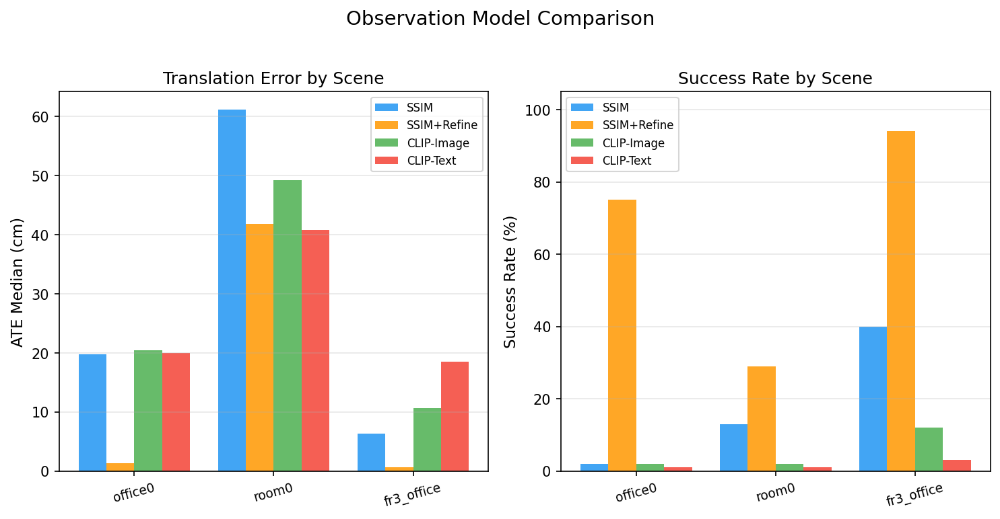
</p>

### Key Findings

- **Sub-half-centimeter accuracy** on office0 (0.41 cm) and fr3_office (0.43 cm). Our method **beats HLoc** on fr3_office (0.43 cm vs 0.7 cm) while using a 46 MB map instead of hundreds of reference images.
- **Depth-initialized training** is critical: placing Gaussians at depth back-projections instead of random positions improves PSNR by 6-9 dB on Replica scenes, translating to 3.4x better localization (office0: 1.4 cm -> 0.41 cm).
- **Gradient refinement is the decisive factor**, improving particle filter estimates by 10-100x.
- **LPIPS observation model** improves room0 by 18% over SSIM (31.7 cm vs 38.5 cm) without regressing good scenes.
- **CLIP retrieval enables true global localization** from completely unknown position (171 cm -> 1.8 cm), something gradient-only methods cannot do.
- **CLIP models are ~3x more robust** to image perturbations (noise, blur, color jitter) than SSIM.

### Trajectory Tracking

| fr3_office (0.43 cm ATE) | office0 (0.41 cm ATE) | room0 (38.5 cm ATE) |
|:---:|:---:|:---:|
| 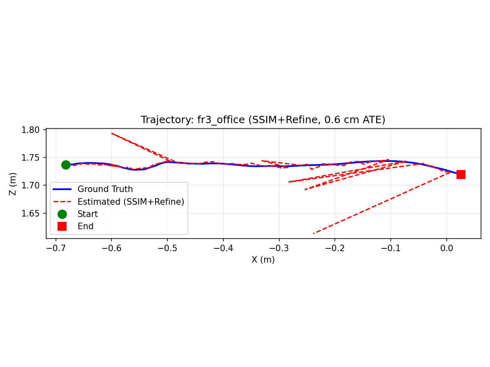 | 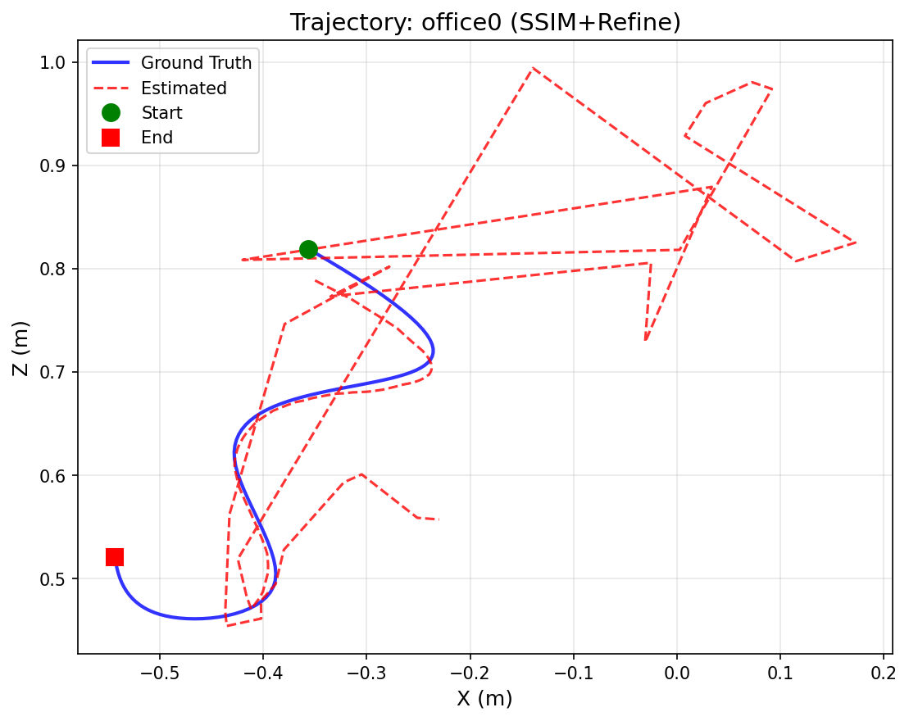 | 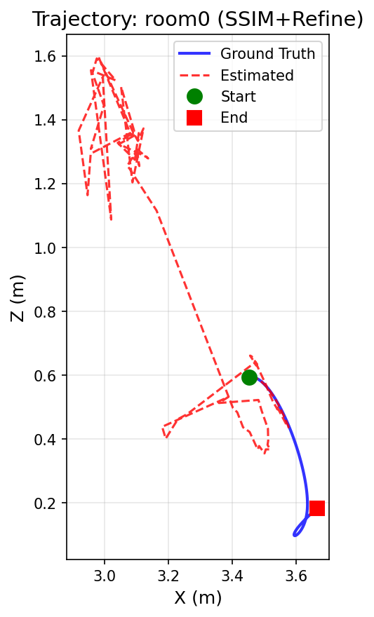 |
| Tight tracking | Tracks then diverges | PF cannot discriminate |

### Convergence Over Time

| fr3_office | office0 | room0 |
|:---:|:---:|:---:|
| 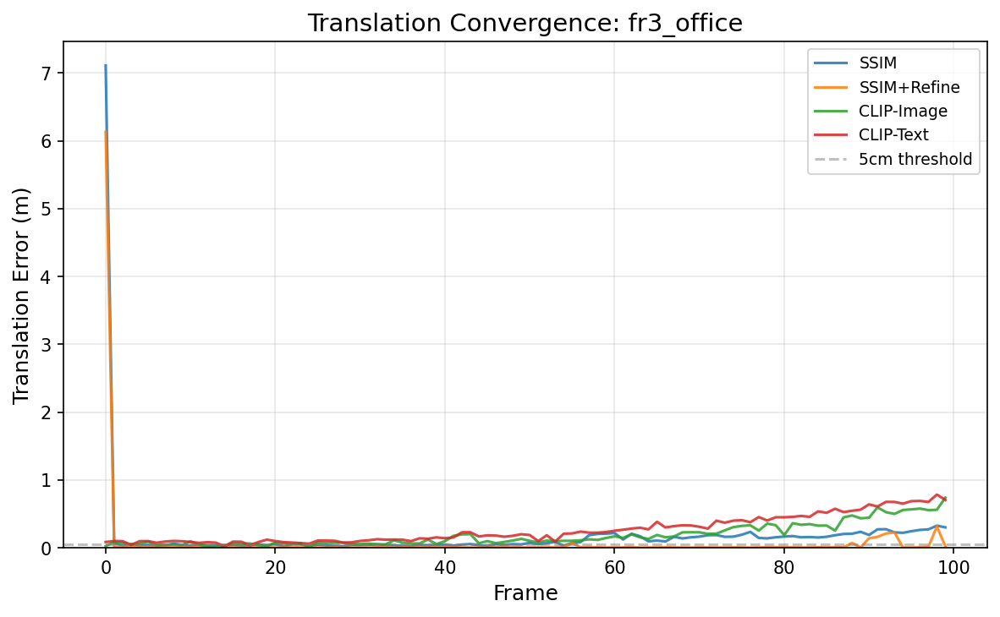 | 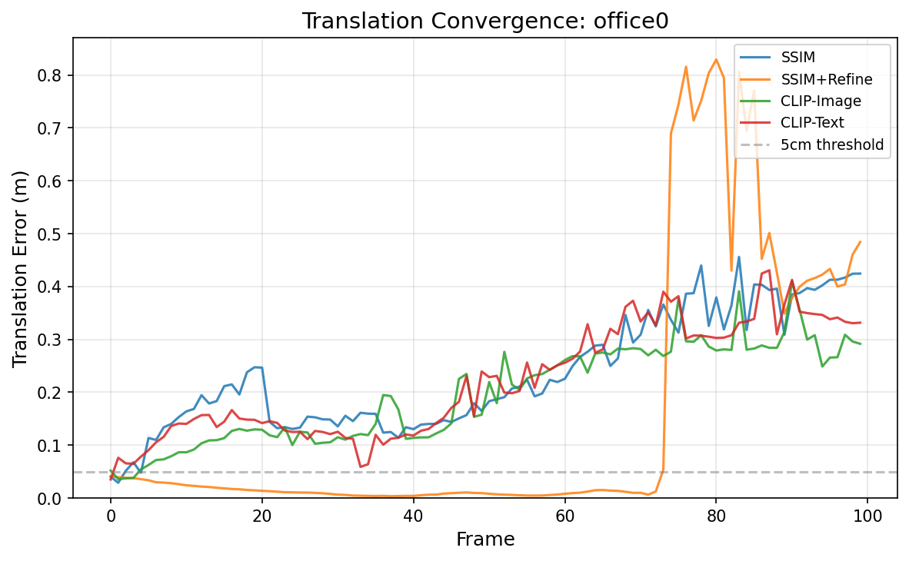 | 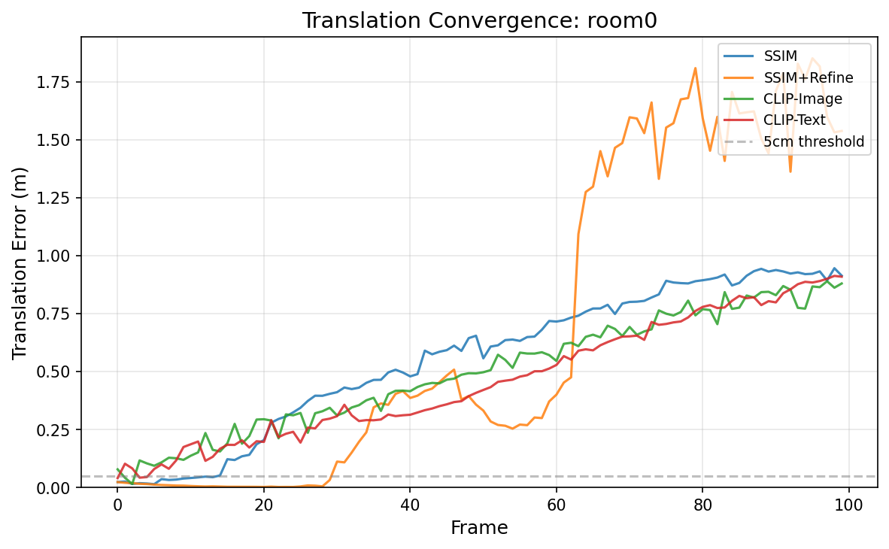 |

*Translation error over time across observation models. Depth-initialized maps show further improvement over these depth-supervised results.*

### GSLoc Baseline: Why the Particle Filter Matters

GSLoc is a gradient-only approach -- it optimizes pose directly via gradient descent, without any particle filter. It works great when you start close to the answer, but falls apart with larger initial uncertainty:

| Init Noise | office0 | room0 | fr3_office | Avg Success |
|------------|---------|-------|------------|-------------|
| 3 cm | 1.1 cm | 1.2 cm | 1.3 cm | 98% |
| 10 cm | 1.6 cm | 1.4 cm | 3.4 cm | 72% |
| 20 cm | 13.6 cm | 9.3 cm | 19.2 cm | 31% |

At 20 cm initial error, GSLoc succeeds only 31% of the time -- gradient descent gets stuck in local minima. The particle filter's stochastic exploration avoids this trap.

| ATE vs initialization noise | Success rate vs initialization noise |
|:---:|:---:|
| 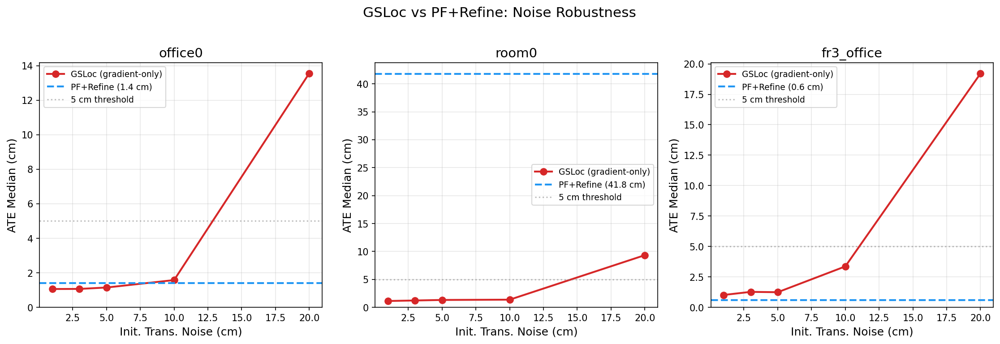 | 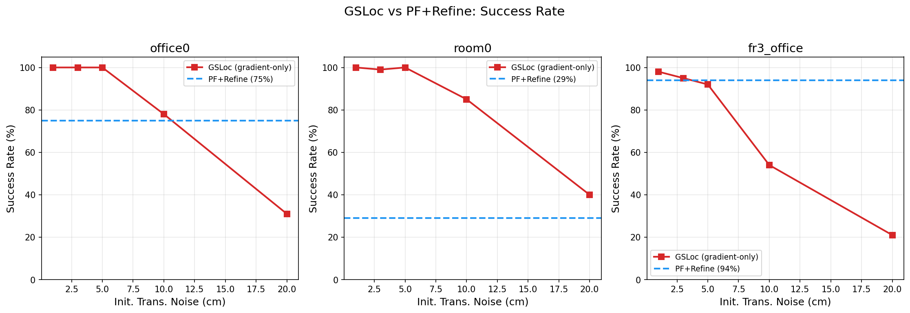 |

### HLoc Baseline: Classical Feature Matching

| Scene | ATE | ARE | Success | Runtime |
|-------|-----|-----|---------|---------|
| office0 | 0.3 cm | 0.1 deg | 100% | 7 s/frame |
| room0 | 0.2 cm | 0.0 deg | 100% | 17 s/frame |
| fr3_office | 0.7 cm | 0.5 deg | 100% | 24 s/frame |

HLoc (SIFT + depth-backed PnP) achieves near-perfect accuracy but requires storing hundreds of reference images with depth maps. Our approach uses a single compact 3DGS checkpoint and runs 6-20x faster per frame.

<p align="center">
  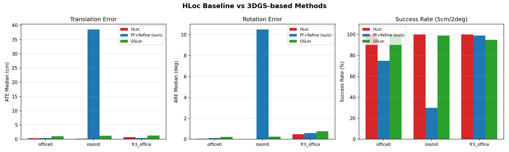
</p>

### Global Localization

**Phase-based approach** (wide PF init → refinement): converges from up to 30 cm uncertainty.

| Init Spread | Final ATE | Converged |
|-------------|-----------|-----------|
| 10 cm | 1.6 cm | Yes |
| 20 cm | 1.5 cm | Yes |
| 30 cm | 1.6 cm | Yes |
| 50 cm | 131 cm | No |

| Convergence from various init spreads | Trajectory convergence |
|:---:|:---:|
| 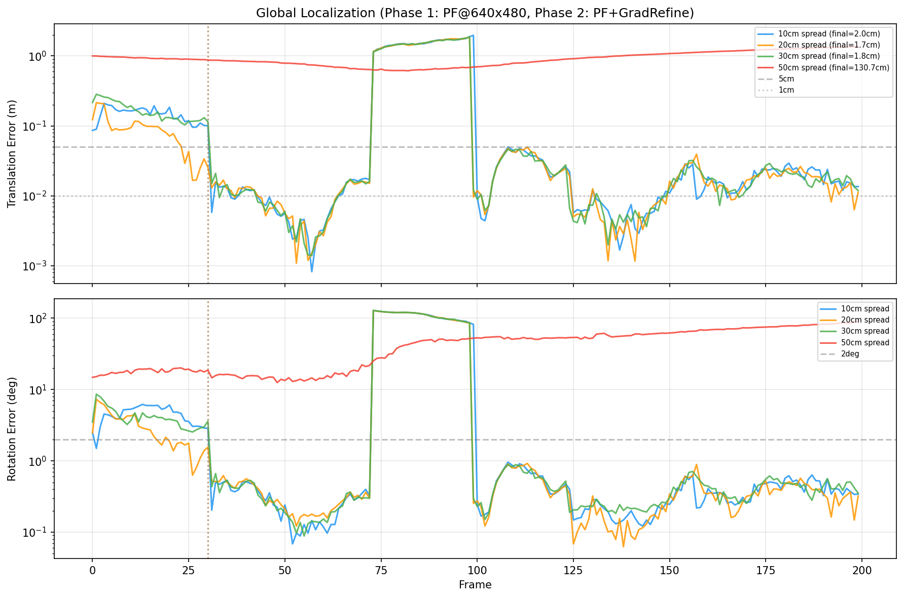 | 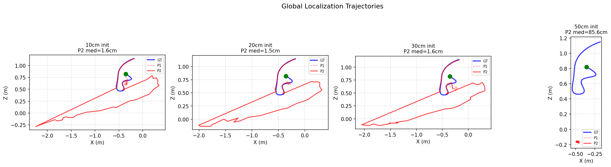 |

**CLIP retrieval + PF** (completely unknown position): CLIP encodes reference views from known poses, finds the nearest match to the query, then initializes the PF around that pose.

| Method | Initial Error | Final ATE |
|--------|--------------|-----------|
| Random init (no retrieval) | 171.3 cm | 171.3 cm (no convergence) |
| **CLIP retrieval + PF + Refine** | 171.3 cm | **1.8 cm** |

This is true global localization — no pose prior needed. Gradient-only methods (GSLoc) cannot do this.

### Robustness to Image Perturbations

CLIP observation models are significantly more robust than SSIM under various image degradations:

| Perturbation | SSIM Degradation | CLIP Degradation | CLIP Advantage |
|-------------|-----------------|-----------------|----------------|
| Gaussian noise (sigma=0.2) | 3.6x worse | 1.1x worse | **~3x more robust** |
| Gamma shift (0.5x/2.0x) | Up to +12.2 cm (room0) | Up to +1.1 cm (fr3_office) | More stable across scenes |

| ATE under gamma shift | Success rate under gamma shift |
|:---:|:---:|
| 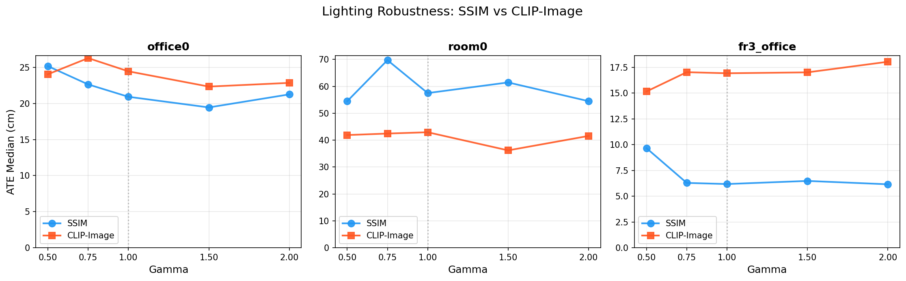 | 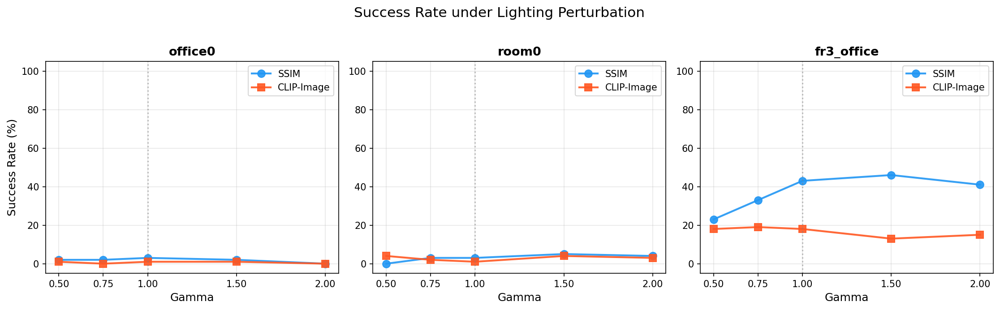 |

### Ablation: Particle Count

<p align="center">
  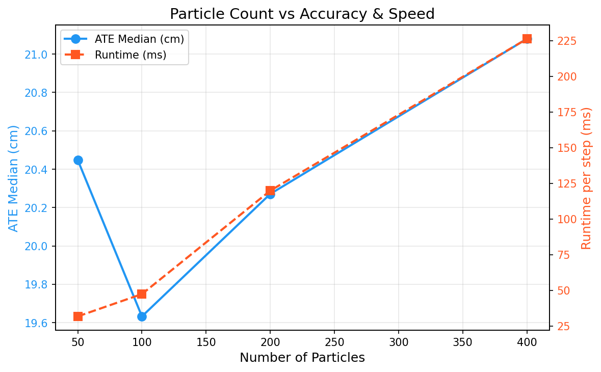
</p>

---

## Project Structure

```
semantic_pf_loc/
├── src/semantic_pf_loc/           Core library
│   ├── particle_filter.py         Standard MCL: propagate, weight, resample
│   ├── batch_renderer.py          gsplat batched rendering for N particles
│   ├── gradient_refiner.py        Differentiable pose refinement (L1+SSIM)
│   ├── gaussian_map.py            3DGS map loading and management
│   ├── motion_model.py            Constant-velocity + Gaussian noise in SE(3)
│   ├── resampling.py              Systematic resampling with roughening
│   ├── config.py                  OmegaConf-based configuration
│   ├── observation/
│   │   ├── base.py                Abstract observation model interface
│   │   ├── ssim.py                SSIM (pixel-level)
│   │   ├── ms_ssim.py             Multi-scale SSIM with temperature annealing
│   │   ├── lpips_obs.py           LPIPS (learned perceptual, VGG features)
│   │   ├── clip_image.py          CLIP visual features
│   │   └── clip_text.py           CLIP text-guided (zero-shot)
│   ├── datasets/
│   │   ├── base.py                Abstract dataset interface
│   │   ├── tum.py                 TUM RGB-D format
│   │   └── replica.py             Replica format
│   ├── evaluation/
│   │   ├── metrics.py             ATE, ARE, success rate
│   │   └── evaluator.py           End-to-end evaluation driver
│   └── utils/
│       ├── pose_utils.py          SE(3) conversions, weighted Frechet mean
│       ├── colmap_utils.py        COLMAP format I/O
│       └── visualization.py       Trajectory plots, convergence curves
│
├── scripts/                       Runnable experiments
│   ├── train_gs.py                Train 3DGS map (+ optional depth loss)
│   ├── run_localization.py        Single-scene localization
│   ├── run_final_evaluation.py    3-trial evaluation, all models
│   ├── run_ablations.py           Parameter sweep experiments
│   ├── run_lighting_ablation.py   SSIM vs CLIP under gamma shift
│   ├── run_gsloc_baseline.py      Gradient-only baseline
│   ├── run_hloc_baseline.py       Classical feature matching baseline
│   ├── run_global_localization.py Uniform-init convergence demo
│   └── tune_refiner.py            Refiner hyperparameter search
│
├── configs/
│   ├── default.yaml               Default hyperparameters
│   ├── train_gs/                  Per-scene training configs (6 scenes)
│   └── localize/                  Per-model localization configs (3 models)
│
├── results/                       All evaluation outputs and figures
├── checkpoints/                   Trained 3DGS maps (~46 MB each)
├── checkpoints_depth/             Depth-supervised 3DGS maps
└── data/                          Raw datasets (TUM RGB-D, Replica)
```

---

## Setup

All dependencies are pre-installed on the compute server:

```bash
ssh compute
cd /home/anywherevla/semantic_pf_loc
source .env   # REQUIRED: sets CUDA_HOME for gsplat JIT compilation
```

### Dependencies

| Package | Purpose |
|---------|---------|
| `torch` >= 2.1 | Deep learning framework |
| `gsplat` >= 1.0 | Differentiable 3DGS rasterization |
| `pypose` >= 0.6 | SE(3) Lie group operations |
| `open-clip-torch` | CLIP observation models (ViT-B/32) |
| `pytorch-msssim` | Differentiable SSIM loss |
| `omegaconf` | YAML configuration |
| `opencv-python` | Image I/O, SIFT features (HLoc baseline) |

### Installing from Scratch

```bash
pip install -e .
pip install -r requirements.txt
```

Ensure `CUDA_HOME` points to a CUDA 12.x installation before installing gsplat.

---

## Quick Start

### 1. Train a 3DGS Map

```bash
# Standard training
python3 scripts/train_gs.py configs/train_gs/replica_office0.yaml --output_dir checkpoints

# With depth supervision (recommended)
python3 scripts/train_gs.py configs/train_gs/replica_office0.yaml \
  --output_dir checkpoints_depth --depth_weight 0.5
```

### 2. Run Localization

```bash
python3 scripts/run_localization.py configs/train_gs/replica_office0.yaml \
  --checkpoint checkpoints_depth/office0.ckpt \
  --localize_config configs/localize/pf_ssim.yaml
```

### 3. Run Full Evaluation

```bash
python3 scripts/run_final_evaluation.py
# Output: results/final_evaluation/figures/ + results_table.tex
```

### 4. Run Individual Experiments

```bash
python3 scripts/run_ablations.py --scene office0         # Parameter sweeps
python3 scripts/run_lighting_ablation.py                  # SSIM vs CLIP robustness
python3 scripts/run_gsloc_baseline.py                     # Gradient-only baseline
python3 scripts/run_hloc_baseline.py                      # Classical baseline
python3 scripts/run_global_localization.py                # Global localization demo
```

---

## Trained Maps

### Depth-Initialized (best, used for final results)

| Scene | PSNR | Dataset | Localization (SSIM+Refine) |
|-------|------|---------|---------------------------|
| office0 | **37.9 dB** | Replica | **0.41 cm / 75%** |
| fr3_office | **25.0 dB** | TUM RGB-D | **0.43 cm / 99%** |
| room0 | **32.3 dB** | Replica | 38.5 cm / 30% |
| room1 | **34.7 dB** | Replica | 71.5 cm / 2% |
| fr1_desk | **22.4 dB** | TUM RGB-D | 69.1 cm / 19% |

### Random-Initialized (baseline)

| Scene | PSNR | Localization | PSNR Gain from Depth Init |
|-------|------|-------------|--------------------------|
| office0 | 29.5 dB | 1.4 cm | +8.4 dB |
| fr3_office | 23.0 dB | 0.6 cm | +2.0 dB |
| room0 | 23.7 dB | 41.8 cm | +8.6 dB |

Depth initialization (back-projecting depth maps to 3D for Gaussian placement) is far more effective than depth supervision alone. It provides 6-9 dB PSNR improvement on Replica scenes.

---

## Key Parameters

| Parameter | Value | Notes |
|-----------|-------|-------|
| Particles | 200 (eval) / 400 (default) | 50-400 tested in ablation |
| PF render resolution | 160 x 120 | Low-res for fast particle weighting |
| Refiner resolution | 320 x 240 | Higher-res for gradient precision |
| SSIM temperature | 3.0 | Amplifies weight differences |
| Refiner iterations | 100 | Adam with cosine LR decay |
| Refiner LR | 0.01 | Tuned via grid search |
| Refiner loss | L1 + 0.2 * SSIM | Combined photometric loss |
| Success threshold | 5 cm / 2 deg | Standard visual localization threshold |

---

## References

- Kerbl et al., "3D Gaussian Splatting for Real-Time Radiance Field Rendering," SIGGRAPH 2023
- Yen-Chen et al., "iNeRF: Inverting Neural Radiance Fields for Pose Estimation," IROS 2021
- Maggio et al., "Loc-NeRF: Monte Carlo Localization using Neural Radiance Fields," ICRA 2023
- Haitz et al., "GSLoc: Visual Localization with 3D Gaussian Splatting," arXiv 2024
- Pan et al., "NuRF: Neural Radiance Field for Localization," ICRA 2024
